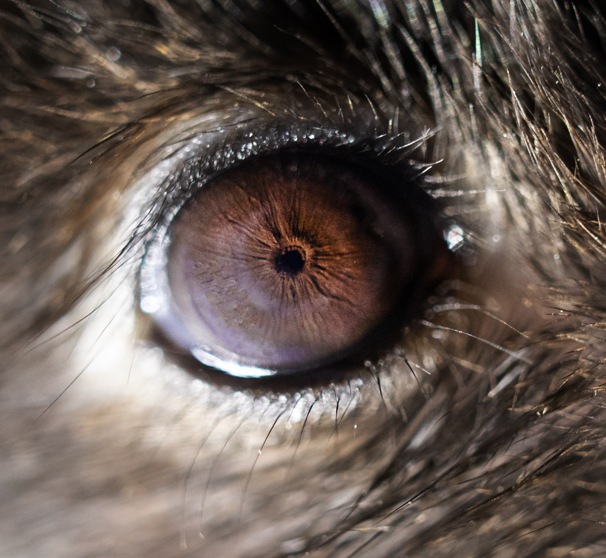
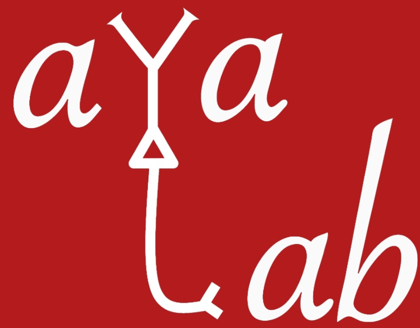

# pupil_project 
Code accompanying the paper: Chang, H.*, Tang, W.*, et al. (2024). Sleep micro-structure organizes memory replay. Nature.

<em>Image taken by ZiFang Zhao, Hongyu Chang and Heath Robinson</em>

# Sleep Micro-Structure Organizes Memory Replay    

- **Version**: 1.0  
- **Author**: Wenbo Tang  
- **Year**: 2024  
- **License**: All rights reserved.  
- **Lab**: [Brain Computation and Behavior Lab](https://braincomputation.org/)
### Description
This repository contains the code and resources for analyses and figures presented in the paper. All scripts are included in the archive `Tang_Nature_2024.tgz`.

## Brief Overview

Code accompanying the paper: Chang, H.*, Tang, W.*, et al. (2024). Sleep micro-structure organizes memory replay. Nature.

## Getting Started

### Prerequisites

Launch MATLAB and cd into the directory containing the code (e.g. '/pupil_project/Main_figure/').

Other files in the directory (with all sub-folders) needed in path:  
https://github.com/ayalab1/neurocode

Toolboxes required:
- Chronux (version 2.12; http://chronux.org/) 

- Uniform Manifold Approximation and Projection (UMAP) (version 4.1; https://www.mathworks.com/matlabcentral/fileexchange/71902-uniform-manifold-approximation-and-projection-umap)

- structure_index (https://github.com/PridaLab/structure_index)

  For visualization:
- MatPlotLib (version 2.1.3; https://www.mathworks.com/matlabcentral/fileexchange/62729-matplotlib-perceptually-uniform-colormaps)

- colormapformulae (version 1.0; https://www.mathworks.com/matlabcentral/fileexchange/66724-colormap-formulae) 

Data from animals included: HYC2, HYC3, PPP4, PPP7, PPP8, PPP10, PPP11, PPP12, PPP13, PPP14, PPP15, PPP16, PVR4, PPP24, PPP25

These codes were originally created in the MATLAB 2017a and 2023b. Source data produced from the scripts are provided along with the paper. 

## FILES and FOLDERS
=================
### Code Organization

This repository contains scripts and resources for analyzing data and generating figures for the project. Below is a breakdown of the folder structure and their respective scripts.

---

### `./Fig1`
Scripts for analyses and visualizations in **Figure 1**:

- `pupil_periodic_Fig1c.m`: Main script for calculating the periodicity of pupil-size dynamics in **Fig. 1c**.
- `sleepstate_umap_ALLstates_Fig1d.m`: Main script for generating UMAP plots demonstrating the sleep state-pupil relationship in **Fig. 1d**.
- `SleepState_LFPfeatures_ALLStates_preprocess_Fig1e.m`: Preprocessing script for gathering LFP features across all sleep states for structure indices (SIs).
- `SleepState_LFPfeatures_NREM_preprocess_Fig1e.m`: Preprocessing script for gathering LFP features within NREM for structure indices.
- `SleepState_rawLFPfeatures_ALLStates_StructureIndex_Fig1e.m`: Main script for calculating SI using LFP features across all sleep states (**Fig. 1e**).
- `SleepState_rawLFPfeatures_NREM_StructureIndex_Fig1e.m`: Main script for calculating SI using LFP features within NREM (**Fig. 1e**).
- `RippleLFP_pupil_umap_example_Fig1g.m`: Main script for generating UMAP plots demonstrating the ripple-pupil relationship in **Fig. 1g**.
- `RippleLFP_pupil_prerprocessing_Fig1h.m`: Preprocessing script for gathering ripple LFP features during NREM for structure indices (SIs).
- `RippleLFP_pupil_rawStructureIndx_Fig1h.m`: Main script for calculating SI using ripple LFP features during NREM (**Fig. 1h**).

---

### `./Fig2`
Scripts for analyses in **Figure 2**:

- `Replay_triggered_pupil_acrossanimal_matchMUA_Fig2b.m`: Main script for calculating replay probabilities across pupil size sextiles during NREM (**Fig. 2b**). Includes firing-rate matched distribution (**EDFig. 5d**). See also `.../src/ReplayDecoding/` for replay decoding demonstration.
- `AllSWR_properties_triggered_pupil_forGLM_Fig2ce.m`: Preprocessing script for gathering ripple and replay properties relative to pupil size for GLMs.
- `Pupil_replayprc_stats_Fig2c.m`: Main script for calculating replay percentages across pupil size sextiles during NREM (**Fig. 2c**).
- `glmgain_ripple_predict_pupil_Fig2e.m`: Main script for predicting pupil size using ripple and replay properties (**Fig. 2e**).

---

### `./Fig3`
Scripts for analyses in **Figure 3**:

- `cal_Cheeseboard_pathLength_Fig3b.m`: Main script for calculating path length in the Cheeseboard task (**Fig. 3b**). Other behavioral measures are in Source Data files.

---

### `./Fig4`
Scripts for analyses in **Figure 4**:

- `Reactivation_FamiliarNovel_triggered_pupil_acrossanimal_Fig4e.m`: Main script for calculating reactivation strength in novel vs. familiar environments across pupil sizes (**Fig. 4e**). See also `.../src/ReactivationStrength/`.
- `Preexist_Reactivation_triggered_pupil_acrossanimal_Fig4g.m`: Main script for calculating reactivation strength for rigid (pre-existing) vs. plastic assemblies (**Fig. 4g**).
- `RankOrder_pupil_acrossanimal_Fig4h.m`: Main script for rank order correlation between PRE and POST sleep across pupil sizes (**Fig. 4h**).

---

### `./Fig5`
Scripts for analyses in **Figure 5**:

- `MUAINT_triggered_pupil_sleep_acrossanimal_Fig5b.m`: Main script for measuring the relationship between pupil size and PYR/INT firing rates (**Fig. 5b**, **EDFig. 10**).
- `CCGtransmission_pupilRippletile_acrossanimals_Fig5d.m`: Main script for gathering spike transmission probability of monosynaptic PYR-INT pairs (**Fig. 5d**).
- `CCGtransmission_pupilRippletile.m`: Function for calculating spike transmission probability of monosynaptic PYR-INT pairs.
- `OptoRippleamp_SpontRipple_triggered_pupil_acrossanimal_Fig5f.m`: Main script for calculating amplitude of spontaneous ripples (**Fig. 5f**).
- `OptoRippleamp_triggered_pupil_acrossanimal_Fig5f.m`: Main script for calculating amplitude of optogenetically induced ripples (**Fig. 5f**).

---

### Subfolders

### `./src`
Contains demonstrations of key analysis steps, including:
- Detecting SWR-associated high-synchrony events (HSEs).
- Calculating reactivation strength.
- Replay decoding.

### `./utilities`
Contains all helper functions.

### `./toolbox`
Contains all required toolboxes. Refer to the original works from the developers for more information.

## CITING OUR WORK

If you find the code useful, please cite the code source and the paper:
**Chang, H.*, Tang, W.*, Wulf, A. M., Nyasulu, T., Wolf, M. E., Fernandez-Ruiz, A., & Oliva, A.** (2024).  
*Sleep micro-structure organizes memory replay.* Nature.  

## CONTACT

Bug reports, comments and questions are appreciated.
Please write to: 
- **Wenbo Tang**: [wenbo.tang07@gmail.com](mailto:wenbo.tang07@gmail.com)  
- **Azahara Oliva**: [aog35@cornell.edu](mailto:aog35@cornell.edu)
